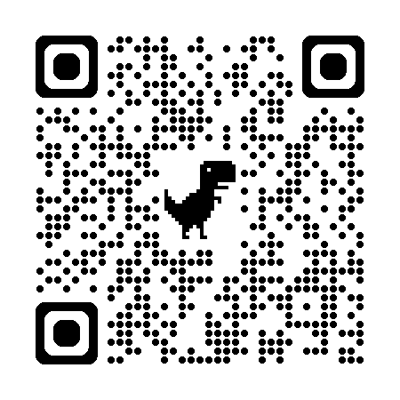

# 🍽️ Cardápio Digital - Restaurant

Projeto desenvolvido com foco em simular um cardápio digital moderno, acessado via QR Code, como utilizado em restaurantes.

---

## 🚀 Acesse o projeto online

👉 https://cardapio-restaurant-six.vercel.app/

---

## 📱 Acesse pelo QR Code

Escaneie para visualizar o cardápio no celular:



---

## ✨ Funcionalidades

- 🔎 Busca por nome do prato
- 🗂️ Filtro por categorias
- 📱 Layout totalmente responsivo
- 🖼️ Exibição dinâmica de produtos
- 💻 Deploy automático via Vercel

---

## 🛠️ Tecnologias utilizadas

- Next.js
- React
- TypeScript
- CSS Modules
- Git & GitHub
- Vercel

---

## 📦 Como rodar o projeto localmente

```bash
# Clonar repositório
git clone https://github.com/BrunaP10/cardapio-restaurant.git

# Entrar na pasta
cd cardapio-restaurant

# Instalar dependências
npm install

# Rodar projeto
npm run dev